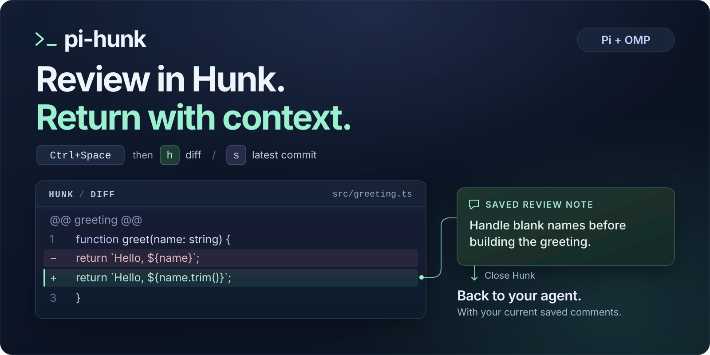

<p align="center">
  
</p>

# pi-hunk

**Full-screen code review, right inside your agent’s terminal.**

Open [Hunk](https://hunk.dev) from [Pi](https://github.com/earendil-works/pi) or
[Oh My Pi](https://omp.sh), review the changes, and leave comments. Close Hunk and your feedback
goes back to the agent—with file, line, and view context. No copy/paste.

[Install](#install) · [Use it](#use-it) · [Configure](#configure)

## Why pi-hunk?

- **Real Hunk.** The full-screen native TUI, not a webview or another diff renderer.
- **Changes, commits, and history.** Switch between working-tree changes and the latest commit, or
  browse native `hunk log` and open selected commits for review.
- **Comments that stay together.** Saved notes survive view switches and returning to history; edits
  replace old text, and deleted notes stay deleted.
- **Your agent’s workflow.** Steer an active turn, queue a follow-up, or interrupt it. The same
  controls work in Pi and OMP.
- **A small integration.** Effect is bundled; the SDKs come from the hosts. No separately installed
  runtime npm dependencies.

## Install

You need **Node.js 22.19+**, **Pi or OMP**, and **Hunk 0.22.0+** available as `hunk` on your `PATH`.
[Install Hunk separately](https://hunk.dev); pi-hunk does not download or manage it. If `hunk` is
missing, older than 0.22.0, or cannot be run, the host shows a warning and does not take over the
terminal. pi-hunk never installs or upgrades Hunk for you.

### Build this checkout

These instructions install the current source implementation, rather than the previous npm release.

```sh
git clone https://github.com/igshehata/pi-hunk.git
cd pi-hunk
npm ci
```

`npm ci` also builds the extension through its `prepare` hook.

<details>
<summary>Replacing an existing pi-hunk installation?</summary>

Remove the previous package source before linking this checkout:

- **OMP:** `omp plugin uninstall pi-hunk --force`
- **Pi, if installed from npm:** `pi remove npm:pi-hunk`

This removes the host’s package registration, not your checkout.

</details>

### Link your host

Run the command for your host **from the pi-hunk checkout**:

**OMP**

```sh
omp plugin link "$PWD"
```

**Pi**

```sh
pi install "$PWD"
```

**Restart your host**, then open it in the repository you want to review. In OMP, `/reload` does not
remount this extension; use a full restart.

## Use it

Press the prefix, release it, then press the view key:

| Keys                                                  | Opens                             |
| ----------------------------------------------------- | --------------------------------- |
| <kbd>Ctrl</kbd> + <kbd>Space</kbd>, then <kbd>h</kbd> | Working-tree changes: `hunk diff` |
| <kbd>Ctrl</kbd> + <kbd>Space</kbd>, then <kbd>s</kbd> | Latest commit: `hunk show`        |
| <kbd>Ctrl</kbd> + <kbd>Space</kbd>, then <kbd>l</kbd> | Native history: `hunk log`        |

1. **Open a view** from your agent’s terminal.
2. **Review and save comments** using Hunk’s normal controls.
3. **Switch diff/show views with the same keys** while on Hunk’s main review screen. Your saved
   comments stay together.
4. **Close Hunk** to return to the agent and hand off your feedback. In a standalone review, this is
   normally <kbd>q</kbd>; in a log review, return to history first, then quit history.

The prefix has no timeout. <kbd>Escape</kbd> cancels it; an unrelated next key passes through
normally. Selecting the current diff/show view does nothing. Hunk controls native input routing:
note-editor text is not interpreted as a view chord. Help and open menus do not necessarily disable
view shortcuts.

### History and Back

Launch `hunk log` with the log chord **from the agent’s terminal**. History keeps Hunk’s native
controls: select commits or a range, then press <kbd>Enter</kbd> to review them. On the selected
review’s main screen, the log chord acts like native <kbd>q</kbd>: it returns to the retained
history screen without closing Hunk or handing off comments. Quit history to submit the saved
comments from all selections together. History comments include Hunk’s original changeset title and
source label, alongside their file and line context. For Git history, the recorded range identifies
the reviewed versions even if the code or file was later removed. The agent is instructed to inspect
that historical diff: old/new line ranges belong to its before/after versions, not today's files.

The prefix is not active on the history screen. Diff/show switching is intentionally unavailable
inside history-selected reviews; those chords show a notice and leave the selection unchanged. The
log chord does not switch a standalone diff/show review to history—close that review and launch log
from the agent.

**Only saved comments are sent.** Unsaved drafts are not submitted, deleted notes are omitted, and
closing an empty review sends no message. Each new review starts fresh.

## Configure

No configuration is required. Run **`/hunk config`** in Pi or OMP to open the host’s native
interactive menu for the prefix, diff key, show key, log key, and feedback delivery. **Save**
persists your changes and applies them immediately—no restart needed. **Cancel** or
<kbd>Escape</kbd> from the main menu discards the draft; <kbd>Escape</kbd> from a field returns to
the menu without changing that field. Finish any active review before opening the menu.

Settings are global to your active host/profile and independent between Pi and OMP. The default
files are:

- **OMP:** `~/.omp/agent/pi-hunk.json`
- **Pi:** `~/.pi/agent/pi-hunk.json`

Native agent-directory overrides and profiles are honored. These files belong to pi-hunk; your
host’s `config.yml` or `settings.json` is left untouched. You can also edit the file directly:

```json
{
  "prefix": "ctrl+space",
  "diff": "h",
  "show": "s",
  "log": "l",
  "delivery": "steer"
}
```

Every field is optional; omitted fields keep the defaults above. For example, `"prefix": "alt+z"`,
`"diff": "d"`, `"show": "v"`, and `"log": "g"` give you another set of bindings. All three view keys
must differ, and `escape` is reserved for canceling the prefix. Invalid configuration is reported,
not silently repaired.

If an existing configuration uses `l` for diff or show, set `log` to a different key when upgrading;
the new default log trigger must not collide with either existing trigger.

Direct file edits take effect on the next host/session start. To apply them now, open `/hunk config`
and Save. Changes made through the command take effect immediately. Installing a new extension build
still requires a full host restart—OMP’s `/reload` is not enough. If your OS or terminal intercepts
<kbd>Ctrl</kbd> + <kbd>Space</kbd>, free that binding or choose another prefix.

### When the agent is busy

| `delivery`          | What happens when you close Hunk                                                  |
| ------------------- | --------------------------------------------------------------------------------- |
| `"steer"` — default | Queue feedback to steer the current turn at the host’s next steering opportunity. |
| `"followUp"`        | Wait for the current turn to finish, then send the feedback.                      |
| `"interrupt"`       | Abort the current turn, wait until the agent is idle, then send the feedback.     |

When the agent is already idle, all three modes send feedback as a new user message and start a
turn.

### Recovering feedback

Nonempty reviews retain a local temporary journal, including after handoff: calling the host’s send
API is not a delivery receipt. If capture or handoff fails, pi-hunk reports the journal path for
recovery rather than silently discarding your work. Journals contain comment text and file paths;
treat them as local review data.

## Development

After changing runtime source, run `npm run build` and restart your host. To run formatting, lint,
type, regression, and packed-install checks:

```sh
npm run check
```

The extension is for interactive TUI sessions, targeting macOS and Linux. Native smoke coverage:
**macOS**, with Pi **0.84.4**, OMP **18.1.10**, and Hunk **0.22.0**. Linux native smoke verification
has not yet been performed.

## License

[MIT](LICENSE). Hunk, Pi, and OMP are separate projects with their own licenses.
